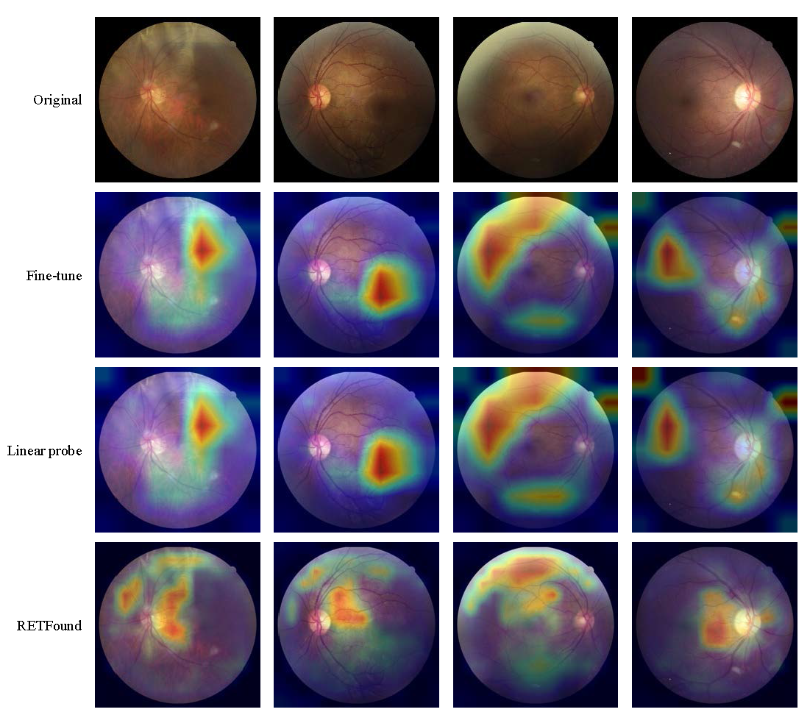

# RETFound - A foundation model for retinal imaging

## Introduction
This is the RETFound for my graduated thesis version. This repository has three main file. `main_eval.py` used to modify and fine-tune pre-training representations of RETFound. `main_test.py` used to test performance. `visualizatin.py` used to visualize behaviors of model. Since this framework base on ViT, its visualized method is n**ot as same as** GradCAM (see the image at the beginning). The visualized techniques come from [HERE](https://github.com/jacobgil/vit-explain).

If you want to know more about this visualized approach, please visit [HERE](https://blog.csdn.net/YI_SHU_JIA/article/details/127223374)

